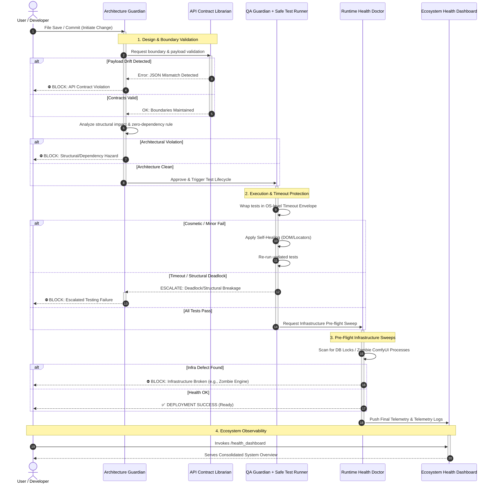

# 🛡️ Anti-Gravity Guardian Workflow Execution (Sequence)

This sequence diagram details the real-time interaction between the guardians when a user introduces a code change. It highlights the primary "Happy Path" along with conditional escalations.

## Sequence Diagram

## Flow Explanation

1. **Initiation & Validation**: 
   The sequence begins when the developer saves a file. The **Architecture Guardian** catches the event and immediately queries the **API Contract Librarian**. If the librarian detects any drift between the frontend components and backend routers, it throws a JSON Mismatch error, allowing the Architecture Guardian to block the commit. If approved, the Architecture Guardian runs its own internal checks for anti-gravity/zero-dependency violations.
   
2. **Safe Execution**: 
   Passing the structural checks, the baton is handed to the **QA Guardian**. This guardian immediately wraps its test executions within the **Safe Test Runner** timeout envelope. If the test fails on a purely cosmetic issue, it enters a self-healing inner loop. If it encounters a timeout or structural deadlock, it will *not* attempt to self-heal; instead, it escalates backward to the Architecture Guardian, dropping a block on the user.

3. **Runtime Sweep**: 
   Assuming a perfect test pass, the **Runtime Health Doctor** executes a live sweep of the OS infrastructure. It looks for silent killers like locked SQLite databases or orphaned `python-build-standalone` instances that tests wouldn't natively catch.

4. **Telemetry Sync**: 
   Upon completion (whether successful or blocked), the current infrastructure footprint logs are funneled into the **Ecosystem Health Dashboard**, which the User pulls on-demand with `/health_dashboard`.
