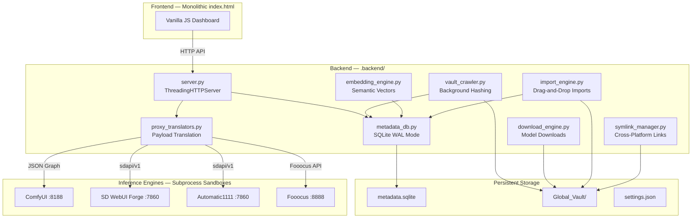

<p align="center">
  
</p>

<h1 align="center">🌌 Antigravity — Generative AI Manager</h1>

<p align="center">
  <strong>The ultimate cross-platform orchestrator that eliminates GenAI ecosystem fragmentation.</strong>
</p>

<p align="center">
  
  
  
  
  
</p>

<p align="center">
  <em>Stop re-downloading Python environments. Stop duplicating 6 GB Stable Diffusion models.<br/>One hub. Every runtime, API, asset, and workflow — unified.</em>
</p>

---

## ✨ What Is Antigravity?

Antigravity is a **self-contained, zero-dependency desktop application** that unifies the fragmented Generative AI ecosystem into a single dashboard. It manages multiple inference engines (ComfyUI, SD WebUI Forge, Automatic1111, Fooocus), shares models across all of them without duplicating a single byte, and automates metadata scraping, semantic search, downloads, and updates — all from one beautiful UI.

**Core Philosophy — "Anti-Gravity":**  
The entire backend runs on the **Python standard library only** (`http.server`, `sqlite3`, `urllib`, `subprocess`). No Flask. No Django. No Node.js. No build step. Just portable Python + a single `index.html`.

---

## 🚀 Features

### 🎨 Zero-Friction Inference Studio
A universal dashboard that drives generations across **ComfyUI**, **SD WebUI Forge**, **Automatic1111**, and **Fooocus** without altering your workflow. Intelligent payload translators automatically map prompts, LoRAs, seeds, dimensions, samplers, ControlNets, and schedulers into each engine's native format.

- **SD 1.5 / SDXL / FLUX.1** pipeline support out-of-the-box
- **Img2Img** drag-and-drop with automatic denoising strength routing
- **Batch Generation Queue** for sequential multi-job processing
- **Hires Upscale** pipelines (latent + ESRGAN variants)

> 📖 [Full documentation →](docs/features/zero_friction_inference.md)

---

### 🏦 Global Vault — Drop Once, Use Everywhere
Drop **any** model into `Global_Vault/` and it becomes instantly available across every installed engine — with **zero disk duplication**. Uses NTFS Directory Junctions (Windows) or symbolic links (UNIX) to create zero-byte references.

- Background SHA-256 hashing indexes multi-GB safetensors without RAM exhaustion
- Automatic CivitAI & HuggingFace metadata scraping with thumbnail downloads
- Semantic search powered by `sentence-transformers` (all-MiniLM-L6-v2, 384-dim embeddings)
- Model version update notifications via CivitAI API polling
- Bulk management: multi-select, batch delete, export/import metadata manifests

> 📖 [Full documentation →](docs/features/global_vault_system.md)

---

### 📦 App Store & Sandboxed Engines
Install new generative applications instantly via simple `.json` recipe templates. Each app runs in its **own isolated Python virtual environment** — PyTorch conflicts are structurally impossible.

- Config-driven recipes for ComfyUI, Forge, A1111, Fooocus, and custom engines
- Automatic Global Vault symlink routing on installation
- Package lifecycle: launch, stop, restart, uninstall with PID tracking
- Extension/plugin management (git clone + remove for custom nodes)
- Live log viewer terminal with stdout streaming
- Visual Recipe Builder with two-column layout and live JSON preview

> 📖 [Full documentation →](docs/features/app_store_isolation.md)

---

### 🔍 Agentic Metadata & Smart Search
Ultra-fast background crawlers hash multi-GB safetensors and automatically scrape CivitAI and HuggingFace for model names, descriptions, thumbnails, and version updates.

- Async threading for near-instant SHA-256 hashing (ThreadPoolExecutor, 4MB chunks)
- CivitAI API alignment with rate-limited polling (1 req/sec)
- HuggingFace Hub search and async headless downloads
- Sentence-transformer embeddings for fuzzy conceptual search
- Real-time sync toast system for indexing status

> 📖 [Full documentation →](docs/features/agentic_model_meta_scraping.md)

---

### 📥 Model Downloads & Imports
One-click downloads from CivitAI and HuggingFace with real-time progress tracking. Drag-and-drop imports with automatic category inference, metadata enrichment, and dependency resolution.

- Auth-header stripping on redirects prevents credential leaks to CDNs
- Subprocess-isolated downloads (killing the server won't abort active downloads)
- 6-stage import pipeline: copy → hash → register → metadata → thumbnail → dependencies
- Automatic companion resource suggestions (e.g., "This LoRA works best with sdxl-vae-fp16-fix")

> 📖 [Downloads →](docs/features/model_downloads.md) · [Imports →](docs/features/model_imports.md)

---

### 🖼️ Studio Analytics & My Creations
Persistent SQLite-backed gallery of all your generations. Drag any thumbnail to instantly restore the exact seed, steps, model, prompt, and configuration back onto the canvas.

- Inline SVG star rating system persisted in SQLite
- Dynamic tag filtering toolbar with unique tag extraction
- A/B Comparison modal with draggable slider and side-by-side parameters
- Sort by newest, oldest, or top-rated with infinite scroll pagination

> 📖 [Full documentation →](docs/features/studio_analytics.md)

---

### 📊 Dashboard & Command Palette
Real-time system health dashboard with live analytics cards (6 stat cards with gradient accents). Power-user keyboard navigation via `Ctrl+K` command palette with 16-command registry and fuzzy search.

- SVG Donut Chart for vault category distribution
- Dashboard Activity Feed merging recent generations (🎨) and downloads (📥)
- Disk Space Warning alerts when vault breaches configurable threshold

---

### 🔄 Self-Healing OTA Updates
One-click ghost upgrades that patch the dashboard via `git pull` or zip extraction without touching your models, settings, installed apps, or database.

- Live server-reboot polling with status feedback
- Data-safe patching that preserves all sacred directories

> 📖 [Full documentation →](docs/features/ota_ghost_upgrades.md)

---

### 🖥️ System Tray Launcher
A polished PyInstaller-bundled desktop application with singleton mutex protection, auto-bootstrap GUI for first-time setup, and silent server management.

- Named mutex ensures only one instance runs at a time
- Tkinter progress window for portable Python auto-download
- Graceful multi-stage shutdown with orphan process sweep
- Full logging to `launcher.log` and `logs/server.log`

> 📖 [Full documentation →](docs/deployment-and-setup.md#system-tray-launcher)

---

## 🏗️ Architecture

Antigravity operates through a cohesive **Three-Layer Agent Architecture:**

| Layer | Purpose |
|-------|---------|
| **Directive** | Project non-negotiables: offline-first, zero data loss, cross-platform parity, zero dependencies |
| **Orchestration** | AI guardians validate changes, enforce quality, and monitor runtime health |
| **Execution** | Python backend, monolithic frontend, SQLite database, subprocess sandboxes |



> 📖 [Full architecture documentation →](docs/architecture.md)

---

## 🚀 Quick Start

### Prerequisites

- **OS:** Windows 10/11, macOS (Intel + Apple Silicon), or Linux (x86_64, aarch64)
- **Disk:** ~200 MB base + your models
- **Git** (optional but recommended for App Store cloning and OTA updates)
- **Network:** Required on first run to download portable Python and sentence-transformers
- **No admin/root** — Windows uses junctions, not symlinks
- **No Node.js/npm** — Pure Python + single HTML file

### Windows
```batch
:: First time setup
install.bat

:: Launch the manager
start_manager.bat
```

### macOS / Linux
```bash
# First time setup
chmod +x install.sh && ./install.sh

# Launch the manager
chmod +x start_manager.sh && ./start_manager.sh
```

The dashboard opens automatically at **http://localhost:8080**.

> [!WARNING]
> Keep the terminal window open while using the application. Closing it will terminate the backend HTTP server.

> 📖 [Full deployment guide →](docs/deployment-and-setup.md)

---

## 📁 Project Structure

```
Antigravity/
├── agents.md                  ← AI agent architecture & coding standards
├── CHANGELOG.md               ← Semantic versioning release history
├── CONTRIBUTING.md             ← Contribution guidelines & anti-gravity rules
├── tray_launcher.py           ← System tray desktop launcher
│
├── .agents/skills/            ← 15 single-responsibility AI skill definitions
├── .agent/rules/              ← Security, cross-platform, data safety rules
│
├── .backend/                  ← Python backend server + APIs
│   ├── server.py              ← HTTP server + API router (45+ endpoints)
│   ├── proxy_translators.py   ← Engine-specific payload translation
│   ├── metadata_db.py         ← SQLite CRUD with WAL mode & migrations
│   ├── vault_crawler.py       ← Background file indexing & SHA-256 hashing
│   ├── embedding_engine.py    ← Sentence-transformer vector generation
│   ├── download_engine.py     ← CivitAI/HF download pipeline
│   ├── import_engine.py       ← Drag-and-drop model import pipeline
│   ├── symlink_manager.py     ← Cross-platform junction/symlink abstraction
│   ├── civitai_client.py      ← CivitAI API client
│   ├── hf_client.py           ← HuggingFace Hub client
│   ├── installer_engine.py    ← Recipe-driven app installation
│   ├── updater.py             ← OTA ghost update pipeline
│   ├── bootstrap.py           ← First-run scaffold & DB initialization
│   ├── static/index.html      ← Monolithic frontend UI (vanilla JS/CSS/HTML)
│   └── recipes/               ← App Store JSON templates
│
├── docs/                      ← Comprehensive project documentation
│   ├── architecture.md        ← System architecture with Mermaid diagrams
│   ├── api-reference.md       ← 45+ endpoint API reference
│   ├── database-schema.md     ← SQLite schema reference
│   └── features/              ← 8 detailed feature breakdowns
│
├── .tests/                    ← QA test suites (pytest + Playwright)
├── icons/                     ← Application icon assets
│
├── Global_Vault/              ← Universal model storage (gitignored)
├── packages/                  ← Installed applications (gitignored)
├── bin/python/                ← Portable Python runtime (gitignored)
└── .backend/metadata.sqlite   ← Model database (gitignored)
```

---

## 🔧 Tech Stack

| Component | Technology | Rationale |
|-----------|-----------|-----------|
| **Backend Server** | Python 3.11+ stdlib `ThreadingHTTPServer` | Zero dependencies. Portable. Ships with python-build-standalone. |
| **Database** | SQLite3 (stdlib, WAL mode) | Single-file, zero-config, thread-safe, survives crashes. |
| **Frontend** | Monolithic HTML/CSS/JS | No build step. Instant reload. Ships as a single file. |
| **Semantic Search** | sentence-transformers (all-MiniLM-L6-v2) | ~80 MB model, CPU-only, 384-dim embeddings. |
| **Portable Python** | python-build-standalone (indygreg) | Platform-specific binaries. No system Python required. |
| **Symlinks** | NTFS Junctions / `os.symlink()` | No admin rights. Zero-byte model sharing. |
| **Process Mgmt** | `subprocess.Popen` + `CREATE_NEW_PROCESS_GROUP` | PID tracking, orphan detection, cross-platform teardown. |
| **HTTP Client** | `urllib.request` (stdlib) | Zero-dependency outbound requests. |

> \* *Zero external Python dependencies except `sentence-transformers` for semantic search.*

---

## 📡 API Overview

Antigravity exposes **45+ REST endpoints** on `http://localhost:8080`:

| Category | Endpoints | Description |
|----------|-----------|-------------|
| **Engine Proxies** | `/api/comfy_proxy`, `/api/forge_proxy`, `/api/a1111_proxy`, `/api/fooocus_proxy` | Unified payload → engine-native translation |
| **Batch Queue** | `/api/generate/batch`, `/api/generate/queue` | Sequential multi-job generation |
| **Vault** | `/api/models`, `/api/vault/search`, `/api/vault/export`, `/api/vault/import` | Model inventory, semantic search, backup |
| **Gallery** | `/api/gallery`, `/api/gallery/save`, `/api/gallery/rate` | My Creations with ratings & tags |
| **Downloads** | `/api/download`, `/api/downloads`, `/api/download/retry` | Background downloads with progress |
| **Imports** | `/api/import`, `/api/import/status`, `/api/import/jobs` | Drag-and-drop model import pipeline |
| **Packages** | `/api/packages`, `/api/install`, `/api/launch`, `/api/stop` | App Store lifecycle management |
| **Extensions** | `/api/extensions`, `/api/extensions/install`, `/api/extensions/remove` | Custom node management |
| **Settings** | `/api/settings`, `/api/server_status`, `/api/shutdown` | Configuration & server control |
| **Prompts** | `/api/prompts`, `/api/prompts/save` | Persistent prompt library |
| **External** | `/api/civitai_search`, `/api/hf/search` | CORS-free proxy to CivitAI & HF |

> 📖 [Full API reference with request/response shapes →](docs/api-reference.md)

---

## 🛡️ Data Safety

These directories and files are **sacred** — never overwritten, deleted, or corrupted by updates:

| Resource | Description |
|----------|-------------|
| `Global_Vault/` | Your model files (checkpoints, LoRAs, VAEs, embeddings) |
| `packages/` | Installed applications and their isolated venvs |
| `.backend/metadata.sqlite` | Model database, gallery, embeddings, tags |
| `.backend/settings.json` | Your preferences, API keys, theme, favorites |
| `bin/` | Portable Python runtime |

All are `.gitignored` and explicitly excluded from OTA update patches.

> 📖 [Data safety rules →](.agent/rules/data_safety.md)

---

## 🤖 AI Agent Ecosystem

This project is co-maintained by humans and **15 specialized AI agents** operating under a strict authority hierarchy:

```
Human User (Final Authority)
  └── Architecture Guardian (Structural Veto Power)
       └── QA Guardian (Testing & Quality)
            └── Diagnostics (Health Doctor, API Librarian — Advisory)
                 └── Workers (Inference Router, Installer, Crawler — Execution)
```

| Agent | Authority | Purpose |
|-------|-----------|---------|
| **Architecture Guardian** | Guardian (L2) | Proactive structural integrity and zero-dependency enforcement |
| **QA Guardian** | Guardian (L3) | Automated regression testing on save/commit |
| **Runtime Health Doctor** | Advisory | Read-only infrastructure health monitoring |
| **API Contract Librarian** | Advisory | JSON payload drift detection |
| **Ecosystem Health Dashboard** | Advisory | Consolidated guardian ecosystem overview |
| **Universal Inference Router** | Worker | Multi-engine payload translation |
| **App Store Installer** | Worker | Config-driven app lifecycle management |
| **Global Vault Symlinker** | Worker | Cross-platform zero-byte model sharing |
| **Asset Crawler & Scraper** | Worker | Background hashing, CivitAI/HF metadata |
| **Canvas Gallery Restore** | Worker | Persistent gallery with parameter restore |
| **OTA Ghost Updater** | Worker | Self-healing code updates |
| **Intelligent Model Router** | Advisory | AI model tier selection for dev tasks |
| **Safe Test Runner** | Worker | OS-level timeout wrapper for QA execution |
| **Codebase Analyst** | Advisory | Read-only investigative code analysis |
| **Codebase Documenter** | Advisory | Systematic documentation generation |

> 📖 [Full agent reference guide →](docs/agent-guide.md) · [Agent architecture →](agents.md)

---

## 🧪 Quality Assurance

This repository maintains rigorous cross-platform stability via the **QA Guardian** testing pipeline with zero-dependency Python unit frameworks and headless Playwright end-to-end testing.

### Run the Full Test Suite
```bash
# Install QA-specific tools
pip install -r requirements-qa.txt
playwright install chromium

# Run backend unit tests with coverage
python -m pytest .tests/ -v --cov=.backend/
```

All Playwright failures automatically preserve `.mp4` video traces for forensic debugging.

---

## 📚 Documentation

Comprehensive documentation lives in [`docs/`](docs/index.md):

| Document | Description |
|----------|-------------|
| [**Architecture**](docs/architecture.md) | System architecture with Mermaid diagrams |
| [**API Reference**](docs/api-reference.md) | 45+ endpoints with request/response shapes |
| [**Database Schema**](docs/database-schema.md) | SQLite schema, WAL mode, migration strategy |
| [**Deployment & Setup**](docs/deployment-and-setup.md) | Installation, boot sequence, tray launcher |
| [**Configuration**](docs/features/configuration.md) | `settings.json` schema and API |
| [**Troubleshooting**](docs/troubleshooting-guide.md) | Diagnostic runbook & health checks |
| [**Agent Guide**](docs/agent-guide.md) | Complete AI agent registry & workflows |

### Feature Documentation
| Feature | Documentation |
|---------|--------------|
| Zero-Friction Inference | [docs/features/zero_friction_inference.md](docs/features/zero_friction_inference.md) |
| Global Vault System | [docs/features/global_vault_system.md](docs/features/global_vault_system.md) |
| App Store & Isolation | [docs/features/app_store_isolation.md](docs/features/app_store_isolation.md) |
| Agentic Meta-Scraping | [docs/features/agentic_model_meta_scraping.md](docs/features/agentic_model_meta_scraping.md) |
| Studio Analytics | [docs/features/studio_analytics.md](docs/features/studio_analytics.md) |
| Model Downloads | [docs/features/model_downloads.md](docs/features/model_downloads.md) |
| Model Imports | [docs/features/model_imports.md](docs/features/model_imports.md) |
| OTA Ghost Upgrades | [docs/features/ota_ghost_upgrades.md](docs/features/ota_ghost_upgrades.md) |

---

## 🤝 Contributing

We welcome contributions! Please read the [**Contributing Guide**](CONTRIBUTING.md) before submitting pull requests.

**Key Rules:**
- **No external Python frameworks** (Flask, Django, FastAPI = ❌)
- **No Node.js / npm / build steps** — the frontend is a single `index.html`
- **Cross-platform required** — every feature must work on Windows, macOS, and Linux
- **Data safety first** — never delete or corrupt `Global_Vault/`, `packages/`, or `metadata.sqlite`

---

## 📋 Changelog

See [**CHANGELOG.md**](CHANGELOG.md) for the full release history following [Semantic Versioning](https://semver.org/).

---

## 📝 License

This project is under active development.

---

<p align="center">
  <sub>Built with the Anti-Gravity philosophy — zero external dependencies, maximum portability.</sub><br/>
  <sub>Python stdlib only* · Single-file frontend · Portable Python · Cross-platform parity</sub>
</p>
